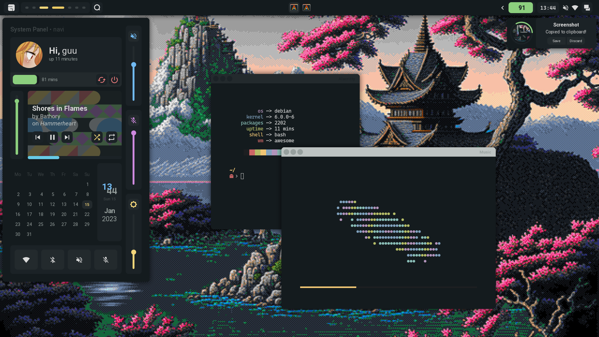

# Welcome, stranger!

<!--  -->


This is my awful configuration for the almighty **AwesomeWM**, featuring a 
user configuration file, repositionable bar and titles, dashboard,
notifications, screenshooting tools, multiple colorschemes, and more to
come, all done with Awesome's widget API!

Both results show on the pictures are achievable through changing just
a few variables in the `userconf.lua` file.

## Dependencies
### Mandatory
- [Awesome-git](https://github.com/awesomeWM/awesome) (duh)
- [mpd](https://github.com/MusicPlayerDaemon/MPD), 
[mpDris2](https://github.com/eonpatapon/mpDris2) and 
[playerctl](https://github.com/altdesktop/playerctl) (music player and actions)
- [Network Manager](https://github.com/NetworkManager/NetworkManager) (network signals)
- [Pipewire](https://github.com/PipeWire/pipewire) and
[Wireplumber](https://github.com/PipeWire/wireplumber) (audio signals)
- [maim](https://github.com/naelstrof/maim),
[xclip](https://github.com/astrand/xclip) (screenshots)
- [Roboto](https://github.com/googlefonts/roboto),
[Material Icons](https://github.com/google/material-design-icons) and
[CascadiaCode Nerd Font](https://github.com/ryanoasis/nerd-fonts/releases/download/)

### Optional (toggleable)
- [brightnessctl](https://github.com/Hummer12007/brightnessctl) (brightness signals)
- [bluez](https://github.com/bluez/bluez) (bluetooth signals)
- [upower](https://github.com/freedesktop/upower) (battery signals)

----------------------
This configuration also uses [alacritty](https://github.com/alacritty/alacritty),
[nvim](https://github.com/neovim/neovim), 
[firefox](https://www.mozilla.org/en-US/firefox/), 
[htop](https://github.com/htop-dev/htop), 
[lf](https://github.com/gokcehan/lf), 
[thunar](https://github.com/xfce-mirror/thunar), 
and [rofi](https://github.com/davatorium/rofi) 
by default, but none of these are hard requirements and you can 
easily change them in `userconf.lua`, although I still recommend **at 
least installing alacritty**.

## Installation

Install the dependencies listed above for your own distro. After that is
done, back your own configuration up, and you need only run:
```sh
$ git clone https://github.com/Gwynsav/gwdawful.git ~/.config/awesome --recursive
```
Also note that CascadiaCode Nerd Font is very likely not packaged for your
distro. It can easily be installed by [getting it](https://github.com/ryanoasis/nerd-fonts/releases/download/v2.2.2/CascadiaCode.zip), 
putting it in either `/usr/share/fonts` or `~/.local/share/fonts/` and 
running `fc-cache -f`.

And that is basically it, note that I do not provide configuration files 
for the programs used by default, this is because those are written in Nix
for my [NixOS rice](https://github.com/Gwynsav/nix-dots/tree/master/users/gw/config). 
You may still use them as reference but they don't exactly work if you're
not using Nix with Home Manager as is.

## Usage
### Basic Keybinds
| Keybind           | Description                 |
| ----------------- | --------------------------- |
| `mod + Shift + w` | Opens the keybindings menu. |
| `mod + Return`    | Opens a terminal.           |

That should be enough for you to access both the configuration and keybinds
menu and see all the other stuff.

### Simple Configuration
You can edit some basic stuff by using the included variables inside of
`userconf.lua`. This configuration includes, border size, gaps, titles and
bar positions, as well as toggling features.

<details>
  
| Variable       | Type      | Description                                            |
| -------------- | --------- | ------------------------------------------------------ |
| Applications   | -         | -                                                      |
| `terminal`     | `string`  | Terminal emulator to use                               |
| `editor`       | `string`  | Text editor to use                                     |
| `browser`      | `string`  | Internet browser to use                                |
| `top`          | `string`  | top application (like htop) to use                     |
| `files_cli`    | `string`  | CLI file explorer to use                               |
| `files_gui`    | `string`  | GUI file explorer to use                               |
| `app_launcher` | `string`  | Application launcher (may deprecate)                   |
| Settings       | -         | -                                                      |
| `modkey`       | `string`  | Mod1 is Alt, Mod4 is Super                             |
| `caps_super`   | `boolean` | Makes CapsLock an additional Super key                 |
| `hover_focus`  | `boolean` | Should windows be focused on hover                     |
| `kb_layout1`   | `string`  | Keyboard layout to use                                 |
| `kb_layout2`   | `string`  | Alternate keyboard layout. Set to same as 1 to disable |
| Features       | -         | -                                                      |
| `battery`      | `boolean` | Enable/disable battery metrics                         |
| `battery_name` | `boolean` | Specify battery name from Upower's interface           |
| `brightness`   | `boolean` | Enable/disable brightness metrics                      |
| `brightness_name` | `boolean` | Specify video adapter name from '/sys/class/backlight' |
| `bluetoothctl` | `boolean` | Enable/disable bluetooth metrics                       |
| UI             | -         | -                                                      |
| `resolution`   | `number`  | Your vertical resolution, eg 1080p                     |
| `aspect_ratio` | `number`  | Your aspect ratio, eg 16/9 or 4/3                      |
| `dpi`          | `number`  | Your dpi, keep at 96 unless you know what you're doing |
| `inner_gaps`   | `number`  | Regular gap size                                       |
| `outer_gaps`   | `number`  | Screen padding size                                    |
| `border_size`  | `number`  | Size of client and widget borders                      |
| `border_rad`   | `number`  | Border rounding, 0 to disable                          |
| `bar_enabled`  | `boolean` | Change default bar state.                              |
| `bar_size`     | `number`  | Change bar thickness (screen %)                        |
| `bar_pos`      | `string`  | May be: left, top, right, bottom                       |
| `bar_gap`      | `boolean` | Apply outer_gaps to bar                                |
| `title_enable` | `boolean` | Enable/disable client titlebars                        |
| `titles_size`  | `number`  | Change titlebar thickness (screen %)                   |
| `titles_pos`   | `string`  | May be: left, top, right, bottom                       |
| `dash_size`    | `number`  | Change dashboard size (screen %)                       |
| `notif_size`   | `number`  | Change notification size (screen %)                    |
| `notif_pos`    | `string`  | May be: top_left, top_right, bottom_left, bottom_right |
| Theming        | -         | -                                                      |
| `clr_palette`  | `string`  | catppuccin, decay, everblush, everforest, tokyonight   |
| `icon_pack`    | `string`  | "default" sets it to Papirus, or GTK icon pack name    |
| `ui_font`      | `string`  | Name of main UI font. Does **NOT** take size.          |
| `ic_font`      | `string`  | Name of text icon font. Does **NOT** take size.        |
| `mn_font`      | `string`  | Name of monospace font. Does **NOT** take size.        |
| `user_avatar`  | `string`  | "default" follows colorscheme, or path                 |
| `user_wall`    | `string`  | "default" follows colorscheme, or path                 |
| `player_bg`    | `string`  | "default" follows colorscheme, or path                 |
| `awm_icon`     | `string`  | "default", "nix", or path                              |
| `scrnshot_dir` | `string`  | Directory to save screenshots to                       |
  
</details>

# References
These people's dotfiles (and in some cases they themselves) have massively
helped me create this configuration.

[Alpha.'s NixOS Awesome setup](https://github.com/AlphaTechnolog/nixdots). 
General reference and stole his helpers :)

[Stardust-kyun's dotfiles](https://github.com/Stardust-kyun/dotfiles). 
Basically the first thing I started reading when I got into Awesome.

[Aproxia's dotfiles](https://github.com/Aproxia-dev/.dotfiles). 
Funny animation ghost.

Also got a few ideas from [elenapan's dotfiles](https://github.com/elenapan/dotfiles) 
and [rxyhn's Yoru](https://github.com/rxyhn/yoru).
